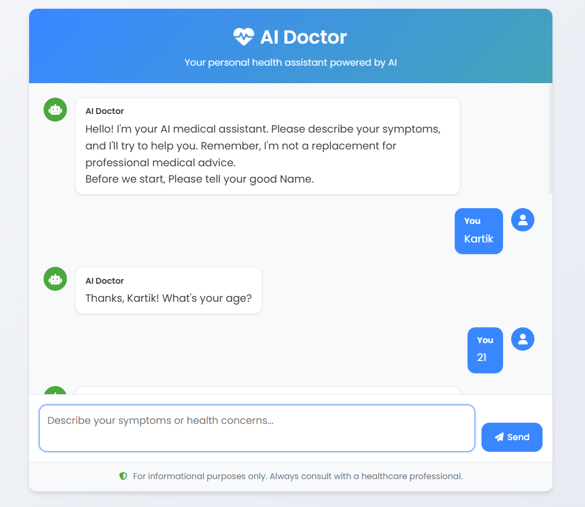
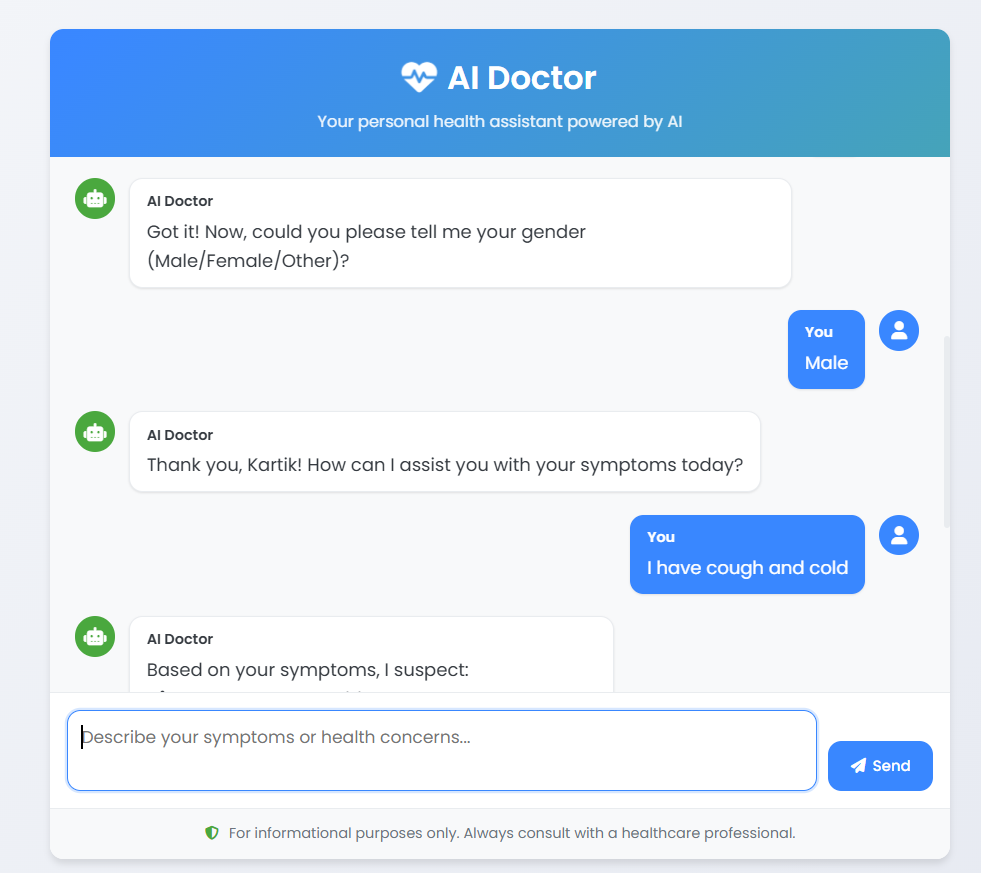
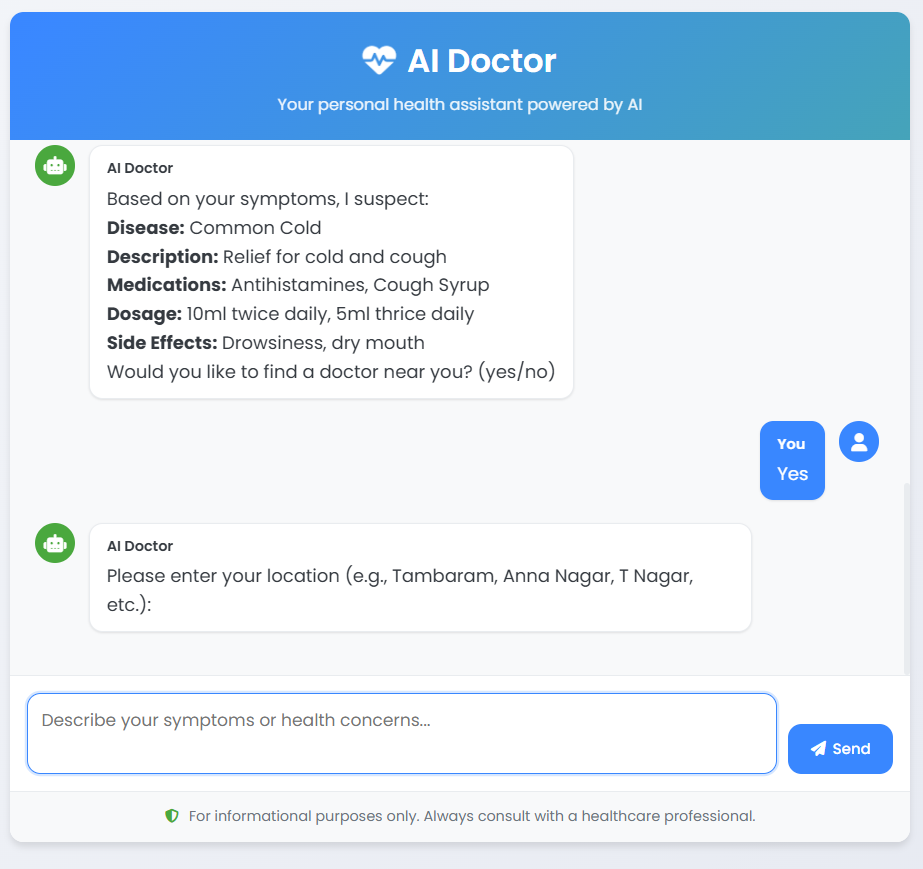
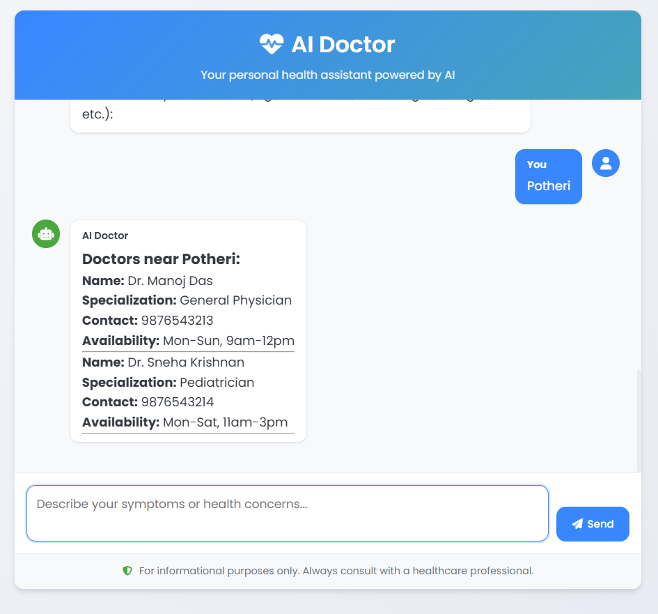

# AI-Doctor-Chatbot-With-DB-MYSQL

An intelligent medical assistant that interacts with users to suggest medications based on symptoms, and optionally helps find doctors nearby. This project uses a MySQL database to store patient and medical data, and integrates Google Gemini for AI-based conversations.

---

## 🧠 Features

- Registers users (name, age, gender)
- Accepts symptoms and provides condition analysis
- Suggests medications based on database
- Provides likely disease suggestions based on multiple symptoms
- Queries Gemini API for natural conversation
- Optionally finds doctors nearby based on user location

---

## 🛠️ Technologies Used

- **Python 3**
- **MySQL**
- **Google Gemini (Generative AI)**
- `regex`, `os`, `mysql.connector`

---

## 🗂️ Project Structure

ai_doctor_chatbot-with-db-mysql/
│
├── database # Has some dump sql files
├── static
    │
    ├── style.css # CSS for frontend
├── templates
    │
    ├── index.html # HTML for frontend
├── app.py # Flask implementation
├── ai_doctor.py # Main chatbot logic
├── requirements.txt # Python dependencies
└── README.md # Project documentation

---

## 🏁 Getting Started

### ✅ Prerequisites

- Python 3.8+
- MySQL Server
- Google Gemini API Key

### 📦 Installation

1. **Clone the Repository**
   
   ```bash
   git clone https://github.com/ek-coder/AI-Doctor-Chatbot-With-DB-MYSQL-
   cd AI-Doctor-Chatbot-With-DB-MYSQL-                               

2. **Set up the Database**
# Login to MySQL and import the dump file
    ```bash
    mysql -u root -p
    mysql> CREATE DATABASE ai_doctor;
    mysql> USE ai_doctor;
    mysql> SOURCE ai_doctor.sql;

3. **Install Python Dependencies*
    ```bash
      pip install -r requirements.txt

4. **Setup GEMINI API Key**
   Edit ai_doctor.py and replace the line:
   ```bash
   api_key = os.getenv("GEMINI_API_KEY") or "AIzaSyC...."
  With your actual API key

5. **Run the Chatbot**
    ```bash
    python app.py

## 🩺 Database Tables

### `patients`
- `name`
- `age`
- `gender`

### `medications`
- `condition`
- `name`
- `description`
- `dosage`
- `side_effects`

### `multi_symptom_treatments`
- `symptom_list`
- `likely_disease`
- `description`
- `medications`
- `dosage`
- `side_effects`

### `doctors`
- `name`
- `location`
- `specialization`
- `contact`

---

## 🌍 Find Nearby Doctors

After suggesting medication, the bot asks:

> **"Would you like help finding a doctor near you?"**

If the user says **yes**, it prompts for the **city or area**, and fetches doctors from the database with relevant details.

---

## 📷 Screenshots

### 📝 Patient Registration



### 💊 Medication Suggestion


### 🏥 Find Nearby Doctor


---

## 🤝 Contributing
Contributions are welcome! Please:
Open Issues for bugs or feature suggestions.
Submit Pull Requests for improvements.


